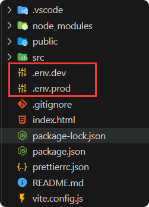
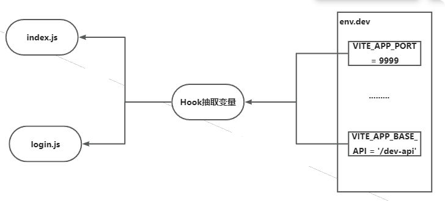

## Vue3通用开发模块

该项目模块作为初始框架，预先集成了多项实用插件，并对这些插件进行了深度定制和封装，从而为开发者提供了一个高效便捷的起点。

开发者可以直接在这个坚实的基础上进行扩展和功能开发，大大节省了前期配置与整合的时间，以更加聚焦于核心业务的实现。

## 技术栈
Vite、Vue3、Router、Pinia、ElementUI、DaisyUI、TailwindCss、Axois。

## 初始化项目
```bash
npm create vite@latest template -- --template vue
```

## Router

1. 安装
    ```bash
    npm install vue-router@4
    ```

2. 配置 `main.js` 配置文件，挂在到全局。
    ```javascript
    import router from '@/router';  // 路由
    
    const app = createApp(App);
    app.use(router);
    app.mount( '#app');
    ```

3. 在 `.src` 文件夹中新建文件夹 `router/index.js`。
    ```javascript
    import { createRouter, createWebHistory } from 'vue-router';
    
    const routes = [
      {
        path: '/',
        name: 'Home',
        component: ()=> import('@/views/Home.vue'),
      },
      {
        path: '/about',
        name: 'About',
        component: ()=> import('@/views/About.vue'),
      }
    ];
    
    const router = createRouter({
      history: createWebHistory(),
      routes
    });
    
    export default router;
    ```

---

## Pinia

1. 安装
    ```bash
    npm install pinia
    ```

2. 全局挂载，在 main.js 文件中添加。
    ```javascript
    import { createApp } from 'vue'
    import App from './App.vue'
    
    const app = createApp(App)
    
    import { createPinia } from 'pinia'
    const pinia = createPinia()
    app.use(pinia)
    
    app.mount('#app')
    ```

---

## ElementUI

1. 安装
    ```bash
    npm install element-plus --save
    ```

2. 挂在全局
    ```javascript
    import { createApp } from 'vue'
    import ElementPlus from 'element-plus'
    import 'element-plus/dist/index.css'
    import App from './App.vue'
    
    const app = createApp(App)
    
    app.use(ElementPlus)
    app.mount('#app')
    ```
### 自动导入

1. 首先你需要安装unplugin-vue-components 和 unplugin-auto-import这两款插件
    ```bash
    npm install -D unplugin-vue-components unplugin-auto-import
    ```

2. 然后把下列代码插入到你的 Vite 的配置文件中
    ```javascript
    // vite.config.ts
    import Components from 'unplugin-vue-components/vite'
    import { ElementPlusResolver } from 'unplugin-vue-components/resolvers'
    
    export default defineConfig({
      // ...
      plugins: [
        // ...
        AutoImport({
          resolvers: [ElementPlusResolver()],
        }),
        Components({
          resolvers: [ElementPlusResolver()],
        }),
      ],
    })
    ```

3. 挂在到全局
    ```javascript
    import ElementPlus from 'element-plus'
    app.use(ElementPlus, { size: 'small', zIndex: 3000 })
    ```

---

## TailwindCss
官网：[https://tailwindcss.com/docs/guides/vite](https://tailwindcss.com/docs/guides/vite)

1. 安装
    ```bash
    npm install -D tailwindcss postcss autoprefixer
    npx tailwindcss init -p
    ```

2. 配置`tailwind.config.js`文件
    ```javascript
    /** @type {import('tailwindcss').Config} */
    export default {
      content: [
        "./index.html",
        "./src/**/*.{js,ts,jsx,tsx}",
      ],
      theme: {
        extend: {},
      },
      plugins: [],
    }
    ```

3. 创建 `.src/styles/tailwind.css` 文件。
    ```javascript
    @tailwind base;
    @tailwind components;
    @tailwind utilities;
    ```

4. 在 main.js 文件中挂在 tailwindCss。
    ```javascript
    //引入tailwindcss
    import '@/styles/style.css'
    ```
## DaisyUI

1. 安装
    ```bash
    npm i -D daisyui@latest
    ```

2. 在`tailwind.config.js`文件中添加插件
    ```javascript
    module.exports = {
      //...
      plugins: [require("daisyui")],
    }
    ```

---

## ref 和 reactive 自动

1. 安装
    ```bash
    npm add unplugin-auto-import -D
    ```

2. 在 `vite.config.js` 配置
    ```javascript
    import AutoImport from 'unplugin-auto-import/vite';
    
    export default defineConfig(({ mode }) => {
      return {
        plugins: [
          vue(),
          // 解决 `import { ref , reactive ..... } from 'vue'` 大量引入的问题
          AutoImport({
            imports: ['vue', 'vue-router'],
          }),
        ],
      };
    });
    ```

---


## 项目运行端口
实际项目中，我们可能分开发环境、测试环境和生产环境。



1. 在根目录建立三个文件：`.env.dev` ，`.env.prod`，`.env.test`。
    ```javascript
    #开发环境
    NODE_ENV = 'development'
    
    # 为了防止意外地将一些环境变量泄漏到客户端，只有以 VITE 为前缀的变量才会暴露给经过 vite 处理的代码。
    # js中通过'import.meta.env.VITE_APP_BASE_API取值
    
    VITE_APP_PORT = 9999
    VITE_APP_BASE_API = '/dev-api'
    
    VITE_APP_BASE_FILE_API = '/dev-api/web/api/system/file/upload'
      
    # 后端服务地址
    VITE_APP_SERVICE_API = 'http://localhost:8888'
    ```
    ```javascript
    #生产环境
      NODE_ENV = 'production'
    
    # 为了防止意外地将一些环境变量泄漏到客户端，只有以 VITE 为前缀的变量才会暴露给经过 vite 处理的代码。
    # js中通过'import.meta.env.VITE_APP_BASE_API取值
    
    VITE_APP_PORT = 7777
    VITE_APP_BASE_API = '/prod-api'
    
    VITE_APP_BASE_FILE_API = '/prod-api/web/api/system/file/upload'
    
    # 后端服务地址
    VITE_APP_SERVICE_API = 'http://localhost:8888'
    ```
    你也可以定义其他变量，必须要以`VITE_`开头，这样才会被`vite`检测到并读取。

2. 在 `package.json` 文件中修改如下，`--mode` 后面的名称必须和 `env`后面相同。
    ```json
    "scripts": {
      "dev": "vite --mode dev",   //开发环境
      "prod": "vite --mode prod", //生产环境
      "build": "vite build",
      "preview": "vite preview"
    },
    ```

3. 配置 `vite.config.js`。
    ```javascript
    import { defineConfig, loadEnv } from 'vite';
    import vue from '@vitejs/plugin-vue';
    
    export default defineConfig(({ mode }) => {
      // 获取`.env`环境配置文件
      const env = loadEnv(mode, process.cwd());
    
      return {
        plugins: [vue()],
        server: {
          // host: 'localhost', // 只能本地访问
          host: '0.0.0.0', // 局域网别人也可访问
          port: Number(env.VITE_APP_PORT),   //项目运行端口
        },
      };
    });
    ```

4. 重新启动项目
    ```bash
    npm run dev
    
    VITE v5.1.3  ready in 318 ms
    ➜  Local:   http://localhost:9999/
    ➜  Network: http://192.168.1.8:9999/
    ➜  press h + enter to show help
    
    
    
    ---------------------------------
    npm run prod
    
    VITE v5.1.3  ready in 319 ms
    ➜  Local:   http://localhost:7777/
    ➜  Network: http://192.168.1.8:7777/
    ➜  press h + enter to show help
    
    ```
    端口成功切换。

---

## 配置路径别名
```javascript
import { defineConfig, loadEnv } from 'vite';
import vue from '@vitejs/plugin-vue';
import * as path from 'path';
import AutoImport from 'unplugin-auto-import/vite';

// https://vitejs.dev/config/
export default defineConfig(({ mode }) => {
  // 获取`.env`环境配置文件
  const env = loadEnv(mode, process.cwd());

  return {
    plugins: [vue()],
    resolve: {
      // 配置路径别名
      alias: [
        // @代替src
        {
          find: '@',
          replacement: path.resolve('./src'),
        },
      ],
    },
  };
});

```

---

## 封装 Axois



1. 安装
    ```bash
    npm install axios
    ```

2. 创建`.src/hooks/**useEnvVariables**.js`
    ```javascript
    import { ref } from 'vue';
    
    // 定义自定义hook
    export default function useEnvVariables() {
      // 创建ref来存储环境变量的值
      const port = ref(import.meta.env.VITE_APP_PORT);
      const baseApi = ref(import.meta.env.VITE_APP_BASE_API);
      const baseFileApi = ref(import.meta.env.VITE_APP_BASE_FILE_API);
      const serviceApi = ref(import.meta.env.VITE_APP_SERVICE_API);
    
      // 返回环境变量的值
      return {
        port,
        baseApi,
        baseFileApi,
        serviceApi,
      };
    }
    ```

3. 在`.src/api/index.js`引入`axios`。
    ```javascript
    import axios from "axios";
    import { hook } from "@/hook/useEnvVariables.js";
    import { ElMessage } from "element-plus"; // 若使用Element UI等UI库处理提示
    
    const { VITE_BASE_API } = hook();
    
    // 创建Axios实例
    const http = axios.create({
      baseURL: VITE_BASE_API, // 设置基础URL
      timeout: 10000, // 请求超时时间
      headers: {
        "Content-Type": "application/json", // 设置默认请求头
      },
    });
    
    // 请求拦截器
    http.interceptors.request.use(
      (config) => {
        // 添加全局请求头、处理身份验证Token等
        config.headers.common["Authorization"] = getToken(); // 假设有个getToken的方法获取token
        return config;
      },
      (error) => {
        return Promise.reject(error);
      }
    );
    
    // 响应拦截器
    http.interceptors.response.use(
      (response) => {
        // 对成功的HTTP响应进行处理
        if (response.data.success) {
          return response.data.data;
        } else {
          // 处理错误情况，例如显示错误消息
          ElMessage.error(response.data.message || "请求失败");
          return Promise.reject(new Error(response.data.message));
        }
      },
      (error) => {
        // 对HTTP请求错误进行处理
        ElMessage.error("网络异常，请稍后再试！");
        return Promise.reject(error);
      }
    );
    
    export default {
      // GET 请求封装
      get(url, config = {}) {
        return http.get(url, config);
      },
    
      // POST 请求封装
      post(url, data = {}, config = {}) {
        return http.post(url, data, config);
      },
    
      // PUT 请求封装
      put(url, data = {}, config = {}) {
        return http.put(url, data, config);
      },
    
      // DELETE 请求封装
      delete(url, config = {}) {
        return http.delete(url, config);
      },
    };
    
    ```

